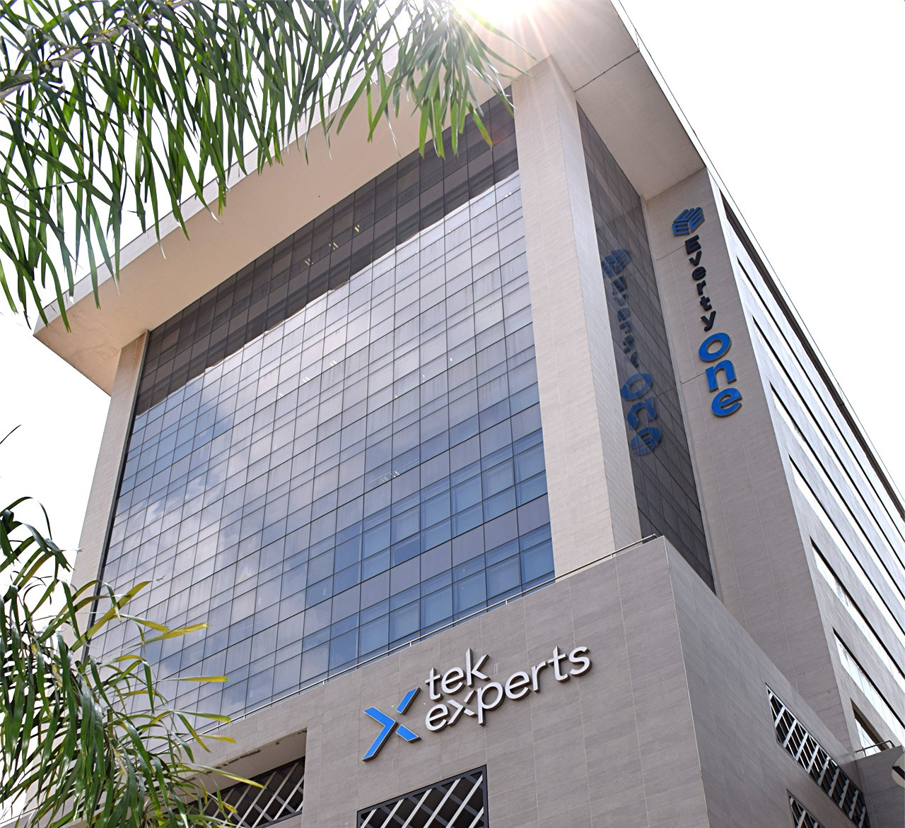

# Work-History
Showcase of my work history 

**Tek Experts – Victoria Island, Lagos**                                                                     

Technical Lead Sept. 2022 – Present 

Technical Support Engineer Sept. 2020 – Sept. 2022 

As a Technical Lead Engineer for Microsoft Dynamics 365 Business Central/NAV, I manage a group of technical 
support engineers who are tasked with resolving problems that affect multiple Microsoft Dynamics Business 
Central/NAV modules, including but not limited to Application, Finance, Inventory, Bank Management, etc. 

Key Achievements
1.  I was responsible for training new team members (engineers) and retraining of old engineers.
2.  Meetings with stakeholders (Partners) to develop solutions and provide the best technical assistance to clients.
3.  Identifying and addressing issues in Microsoft Dynamics Business Central/Nav that affect a variety of modules, including as finance, approval workflows, inventories, and integrations with other Microsoft products (such as Dynamics Sales).
4.  Identifying potential workarounds for issues/bugs in the Business Central Application.
5.  Investigating system performance issues and making recommendations to Microsoft partners on how 
to improve performance.
6.  Obtaining telemetry information on failures and events using the Kusto query language (KQL).
7.  As the team's senior engineer, it is my duty to handle escalation from other engineers and to swiftly 
and effectively provide a solution.
8.  As an escalation engineer, I handle issues with high business impact and bugs to the engineering 
team.
9.  Microsoft 365 Business Central reporting, connecting Power Bi, and SQL architecture.
10. Basic AL customization of the application in Visual Studio, and AL Language for development. 

[See More](https://javabot01.github.io/)
